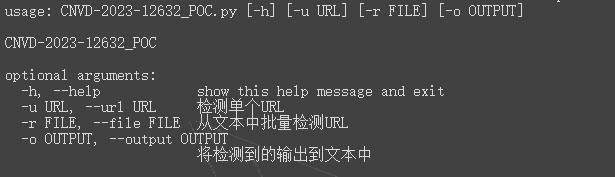
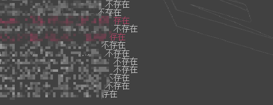

# 泛微e-cology9_SQL注入（CNVD-2023-12632）

## 影响版本

```
泛微e-cology V9 < 10.56
```


## 使用方法

```
-h		帮助
-u		检测单个URL
-r		读取文件批量检测
-o		将检测到的输出到文本中
```



```
python test.py -r url.txt -o check.txt
```

会再当前目录下生成check文件，内容为成功验证的结果




免责声明：请勿利用文章内的相关技术从事非法测试，由于传播、利用此文所提供的信息或者工具而造成的任何直接或者间接的后果及损失，均由使用者本人负责，所产生的一切不良后果与文章作者无关。该文章仅供学习用途使用。

